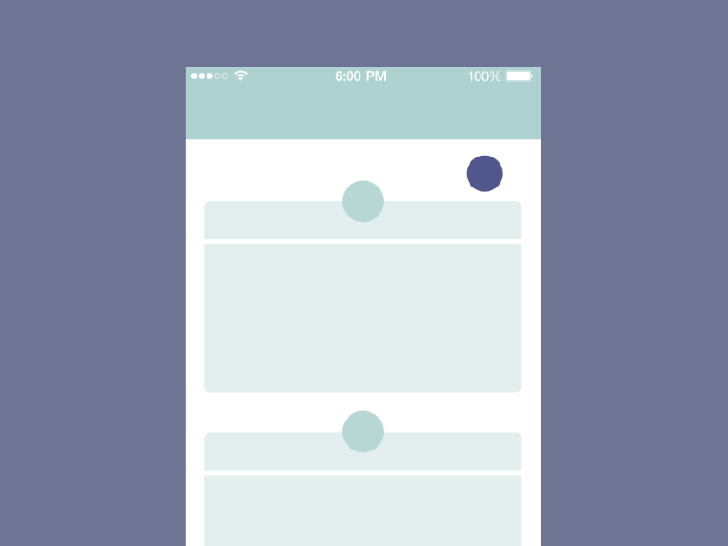
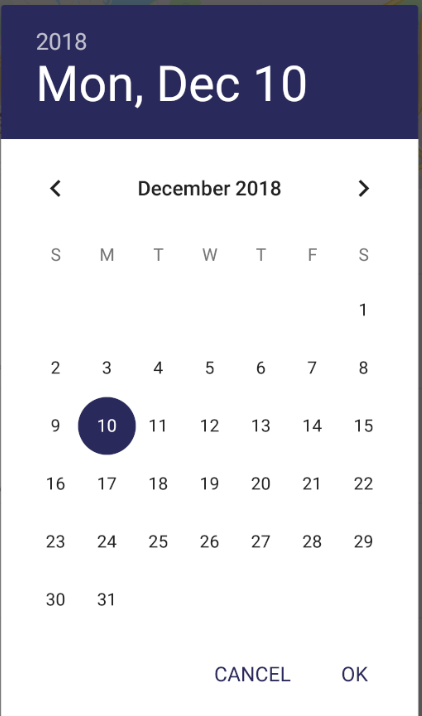
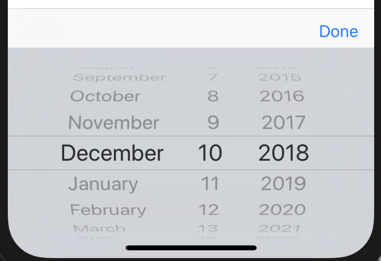
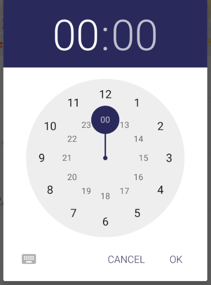
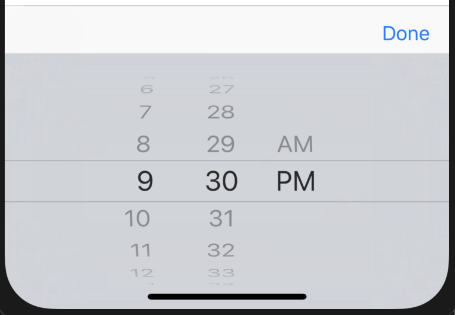

# xamarin-uitest-tricks
Let's solve the problems that I faced while automating some specific UI Controls in Android and iOS applications in Xamarin.UITest

## `Pull-To-Refresh:`
Automating pull-to-refresh is sometimes difficult and handled very differently in iOS and Android applications. Why? Let's see the code:


*Android:*

 
```C#
        /// <summary>
        /// Gets a value indicating whether this <see cref="T:Xpenditure.Mobile.SpecFlow.PullToRefresh"/> refresh
        /// indicator is displayed.
        /// </summary>
        /// <value><c>true</c> if refresh indicator is displayed; otherwise, <c>false</c>.</value>

        public bool RefreshIndicatorIsDisplayed
        {
            get
            {
                return (bool)App.AppInstance.Query(x => x.Class("MvxSwipeRefreshLayout").Invoke("isRefreshing")).First();
            }
        }
        
        /// <summary>
        /// Waits for refresh indicator to disappear.
        /// </summary>
        /// <param name="timeoutInSeconds">Timeout in seconds.</param>
        public void WaitForIndicatorToDisappear(int timeoutInSeconds = 20)
        {
            int counter = 0;
            while (RefreshIndicatorIsDisplayed)
            {
                Thread.Sleep(2000);//Can be anything
                counter++;

                if (counter >= timeoutInSeconds)
                    throw new Exception($"Loading the list took longer than {timeoutInSeconds}");
            }
        }

        /// <summary>
        /// Refreshs the page by co-ordinates(fromX, fromY, toX, toY).
        /// </summary>
        public void RefreshPage()
        {
            App.AppInstance.DragCoordinates(0.5f * helper.GetScreenWidth(), 0.5f * helper.GetScreenHeight(),0.5f * helper.GetScreenWidth(), 0.9f * helper.GetScreenHeight() );
        }
```

*iOS:*

 
```C#
        /// <summary>
        /// Gets a value indicating whether this <see cref="T:Xpenditure.Mobile.SpecFlow.PullToRefresh"/> refresh
        /// indicator is displayed.
        /// </summary>
        /// <value><c>true</c> if refresh indicator is displayed; otherwise, <c>false</c>.</value>
        public bool RefreshIndicatorIsDisplayed
        {
            get
            {
                return (bool)App.AppInstance.Query(x => x.Class("PullToBounce_BallView")).Any();
            }
        }

        /// <summary>
        /// Waits for refresh indicator to disappear.
        /// </summary>
        /// <param name="timeoutInSeconds">Timeout in seconds.</param>
        public void WaitForIndicatorToDisappear(int timeoutInSeconds = 30)
        {
            int counter = 0;
            Thread.Sleep(2000);
            while (RefreshIndicatorIsDisplayed)
            {
                Thread.Sleep(200);//Value determined by user
                counter++;

                if (counter >= timeoutInSeconds)
                    throw new Exception($"Loading the list took longer than {timeoutInSeconds}");
            }
        }

        /// <summary>
        /// Refreshs the page.
        /// </summary>
        public void RefreshPage()
        {
            App.AppInstance.DragCoordinates(0.5f * helper.GetScreenWidth(), 0.15f * helper.GetScreenHeight(), 0.5f * helper.GetScreenWidth(), 0.9f * helper.GetScreenHeight());
        }
```
 


## `DatePicker`
Let's see how we can automate the `DatePicker` controls in Android and iOS.

*Android:*

 

```C#
        #region Android Configuration
        private const string AndroidDatePickerClass = "datePicker";
        private const string DatePickerClass = "DatePicker";
        private const string AndroidOKButton = "button1";
        private static readonly TimeSpan DefaultTimeout = TimeSpan.FromSeconds(5);
        #endregion

        /// <summary>
        /// Updates the date picker.
        /// </summary>
        /// <param name="date">Date.</param>
        /// <param name="pickerClass">Picker class.</param>
        public void UpdateDatePicker(string date, string pickerClass = AndroidDatePickerClass)
        {
            string[] dateTokens = date.Split('/');
            var day = dateTokens[0];
            var month = dateTokens[1];
            App.AppInstance.Tap(x => x.Class(pickerClass));
            App.AppInstance.WaitForElement(x => x.Class(DatePickerClass), timeout: DefaultTimeout);  //can remove the hard-coding for year
            App.AppInstance.Query(x => x.Class(DatePickerClass).Invoke("updateDate", 2018, int.Parse(month) - 1, int.Parse(day)));
            App.AppInstance.Tap(x => x.Id(AndroidOKButton));
        }
```

*iOS:*

 
```C#
        #region iOS Configuration
         private const string iOSDatePickerClass = "UIDatePicker";
         private const string iOSTableViewClass = "UIPickerView";
         private const int iOSDateMonthColumn = 0;
         private const int iOSDateDayColumn = 1;
         private const int iOSDateYearColumn = 2;
         private const string iOSDoneButtonText = "Done";
         public AppResult[] iOSDoneButton => App.AppInstance.WaitForElement(x => x.Text(iOSDoneButtonText));
         #endregion
 
         private static readonly TimeSpan DefaultTimeout = TimeSpan.FromSeconds(5);
        /// <summary>
         /// Selects provided date in the Picker.
         /// Workaround: Always Tap on expected value before tapping Done.
         /// </summary>
         /// <param name="date">Date.</param>
         public void UpdateDatePicker(string date)
         {
             string year = "2018"; //can remove the hard-coding
             string[] dateTokens = date.Split('/');
             int day = int.Parse(dateTokens[0]);
             int month = int.Parse(dateTokens[1].TrimStart('0'));
             try
             {
                 year = int.Parse(dateTokens[2]).ToString();
             }
             catch (System.IndexOutOfRangeException e)
             {
                 System.Console.WriteLine(e.Message);
             }
             App.AppInstance.WaitForElement(x => x.Class(iOSDatePickerClass), timeout: DefaultTimeout);
             ScrollToPickerColumn(iOSDateMonthColumn, month);
             App.AppInstance.Tap(x => x.Marked(CultureInfo.CurrentCulture.DateTimeFormat.GetMonthName(month))); //Get current Month Name by month number
             ScrollToPickerColumn(iOSDateDayColumn, day);
             App.AppInstance.Tap(x => x.Marked(day.ToString()));
             ScrollToPickerColumn(iOSDateYearColumn, int.Parse(year));
             App.AppInstance.Tap(x => x.Marked(year));
             App.AppInstance.Tap(iOSDoneButton[0].Text);
         }   
        
         /// <summary>
         /// Scrolls and Selects to the designated picker column and value
         /// WorkAround: Scrolls to the next value(makred+1) than the expected value
         /// </summary>
         /// <param name="columnIndex">Column index.</param>
         /// <param name="marked">Marked (starts from index '0' in iOS)</param>
         private static void ScrollToPickerColumn(int columnIndex, int marked)
          {
              System.Threading.Thread.Sleep(1000); //adding sleep to make the scrolling stable
              App.AppInstance.Query(x => x.Class(iOSTableViewClass).Invoke("selectRow", marked + 1, "inComponent", columnIndex, "animated", true));
          }
```


## `TimePicker`
Let's see how we can automate the `TimePicker` controls in Android and iOS. It can be sometimes tricky as iOS has 12 and 24 hours format depending on the timezones in simulator.

*Android:*

 
```C#
        #region Android Configuration
        private const string AndroidTimePickerClass = "android.widget.TimePicker";
        /// Android Set Minute and Set Hour method names for the TimePicker class.
        private const string AndroidTimePickerSetMinuteMethod = "setCurrentMinute";
        private const string AndroidTimePickerSetHourMethod = "setCurrentHour";
        private const string AndroidOKButton = "button1";
        private static readonly TimeSpan DefaultTimeout = TimeSpan.FromSeconds(5);
        #endregion

        /// <summary>
        /// Updates the time picker.
        /// </summary>
        /// <param name="time">Time.</param>
        /// <param name="pickerClass">Picker class.</param>
        public void UpdateTimePicker(string time, string pickerClass = AndroidTimePickerClass)
        {
        string[] timeTokens = time.Split(':');
        var hours = timeTokens[0];
        var minute = timeTokens[1];
        App.AppInstance.WaitForElement(x => x.Class(pickerClass), timeout: DefaultTimeout);
        App.AppInstance.Query(c => c.Class(pickerClass).Invoke(AndroidTimePickerSetHourMethod, int.Parse(hours)));
        App.AppInstance.Query(c => c.Class(pickerClass).Invoke(AndroidTimePickerSetMinuteMethod, int.Parse(minute)));
        App.AppInstance.Tap(x => x.Id(AndroidOKButton));
        }
```

*iOS:*
In iOS, `TimePicker` can be of 2 types: `24 Hour Clock` or `12 Hour Clock`.

 
```C#
         #region iOS Configuration
         private const string iOSDatePickerClass = "UIDatePicker";
         private const string iOSTableViewClass = "UIPickerView";
         private const int iOSTimeHourColumn = 0;
         private const int iOSTimeMinuteColumn = 1;
         private const int iOSTimePeriodColumn = 2;
         private const string iOSDoneButtonText = "Done";
         public AppResult[] iOSDoneButton => App.AppInstance.WaitForElement(x => x.Text(iOSDoneButtonText));
         #endregion 
         
         /// <summary>
         /// Updates the time picker.
         /// Note: Picker loads +/-3 values from the current selection
         /// </summary>
         /// <param name="time">Time.</param>
         public void UpdateTimePicker_24HrClock(string time)
         {
             string[] timeTokens = time.Split(':');
             var hours = timeTokens[0];    //Hours as per 24 hour clock
             var minutes = timeTokens[1];
             App.AppInstance.WaitForElement(x => x.Class(iOSDatePickerClass), timeout: DefaultTimeout);
             ScrollToPickerColumn(iOSTimeHourColumn, int.Parse(hours));
             App.AppInstance.Tap(x => x.Marked(hours));
             ScrollToPickerColumn(iOSTimeMinuteColumn, int.Parse(minutes));
             if (App.AppInstance.Query(x => x.Marked(minutes)).Length > 1) //checking length to avoid multiple entries(Eg. 22:00,23:00)
             {
                 int index = App.AppInstance.Query(x => x.Marked(minutes)).Length;
                 App.AppInstance.Tap(x => x.Marked(minutes).Index(index - 1));
             }
             else
             {
                 App.AppInstance.Tap(x => x.Marked(minutes).Index(0));
             }
             App.AppInstance.Tap(iOSDoneButton[0].Text);
         }       
        
        /// <summary>
        /// Updates the time picker.
        /// </summary>
        /// <param name="time">Time.</param>
        public void UpdateTimePicker_12HrClock(string time)
        {
            string[] timeTokens = time.Split(':');
            string period = int.Parse(timeTokens[0]) >= 12 ? "PM" : "AM";
            int hours = int.Parse(timeTokens[0]); //Hours as per 24 hour clock
            string minutes = timeTokens[1];
            App.AppInstance.WaitForElement(x => x.Class(iOSDatePickerClass), timeout: DefaultTimeout);
            if (int.Parse(timeTokens[0]) > 12)
            {
                hours = int.Parse(timeTokens[0]) - 12; //hours as per 12 hour clock
            }
            ScrollToPickerColumn(iOSTimeHourColumn, hours);
            App.AppInstance.Tap(x => x.Marked(hours.ToString()));
            ScrollToPickerColumn(iOSTimeMinuteColumn, int.Parse(minutes));
            App.AppInstance.Tap(x => x.Marked(minutes));
            ScrollToPickerColumn(iOSTimePeriodColumn, 1);
            App.AppInstance.Tap(x => x.Marked(period));
            App.AppInstance.Tap(iOSDoneButton[0].Text);
        }
        
         /// <summary>
         /// Scrolls and Selects to the designated picker column and value
         /// WorkAround: Scrolls to the next value(makred+1) than the expected value
         /// </summary>
         /// <param name="columnIndex">Column index.</param>
         /// <param name="marked">Marked (starts from index '0' in iOS)</param>
         private static void ScrollToPickerColumn(int columnIndex, int marked)
         {
           System.Threading.Thread.Sleep(1000); //adding sleep to make the scrolling stable
           App.AppInstance.Query(x => x.Class(iOSTableViewClass).Invoke("selectRow", marked + 1, "inComponent", columnIndex, "animated", true));
         }      
```

## `ScreenSize`
```C#
        readonly AppRect size;
        readonly float width;
        readonly float height;

        public ScreenSizeHelper()
        {
            size = App.AppInstance.Query()[0].Rect;
            width = size.Width;
            height = size.Height;
        }

        public float GetScreenWidth() => width;

        public float GetScreenHeight() => height;
```

*Stay tuned for more tips and code!!*